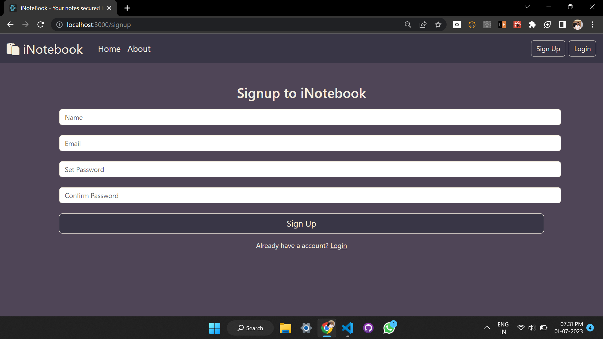
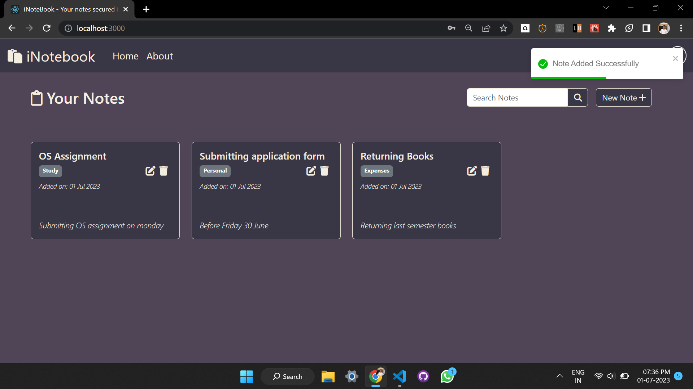
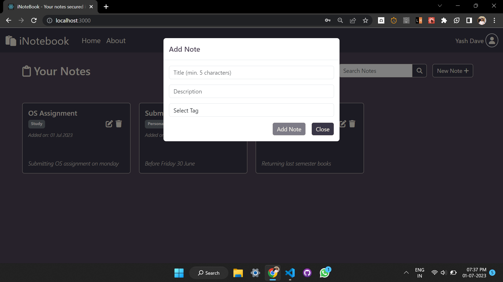
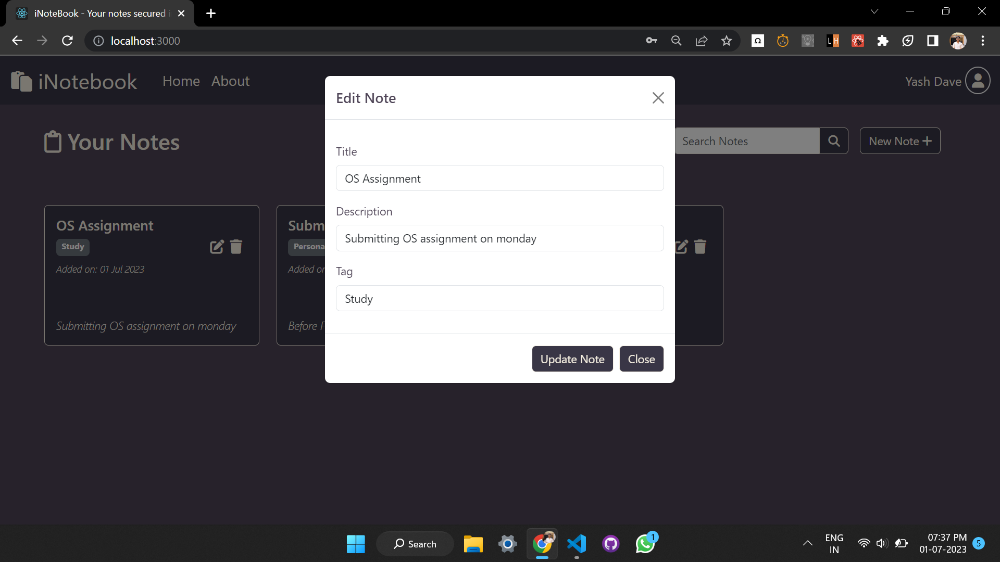

## About iNotebook:
iNotebook is a web application that stores all your notes on the cloud which makes it accessible from any device.

## Features:
0. Login/Signup.
1. Add a new Note.
2. Update existing Note.
3. Delete a existing Note.
4. Search from the existing Notes.
5. Get Notifications.
6. Logout.

## Snapshots on the project:
1. SignUp Page.\   
2. Login Page.\ 
3. Home Page.\ 
4. Add Note Section.\ 
5. Update Note section.\ 
6. User Profile Section.\ 

## Technologies Used:
1. Backend:-   Nodejs(Expressjs) 
2. Frontend:-  React.js
               Bootstrap   
3. Database:-  MongoDB
        

## Dependencies Used:
Backend :- 1. bcryptjs\
           2. cors\
           3. dotenv\
           4. express\
           5. express-validator\
           6. jsonwebtoken\
           7. mongoose\

Frontend :- 1. concurrently\
            2. dotenv\
            3. react\
            4. react-dom\
            5. react-router-dom\
            6. react-scripts\
            7. react-toastify\

## Run on your Local Device:

### `npm install`
    To install all the Frontend packages.

### `cd '.\Backend'`
### `npm install`
    To install all the Backend packages.

Change the MONGODB string to your owns and assign a JWTSERCET of your owns.

### `npm run both`

This runs the app in the development mode on [http://localhost:3000](http://localhost:3000) and runs SERVER on [http://localhost:4000](http://localhost:4000)
