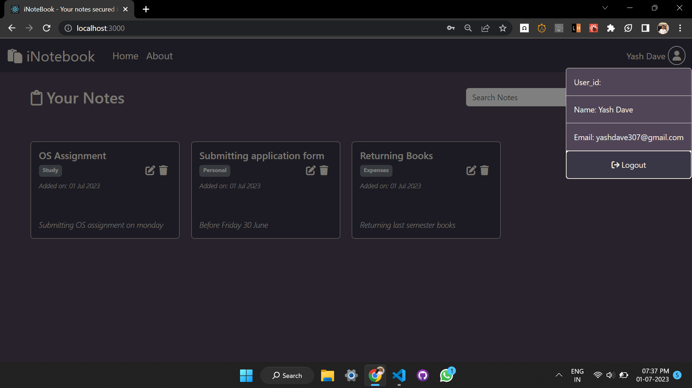

## About iNotebook:
iNotebook is a web application that stores all your notes on the cloud which makes it accessible from any device.

## Features:
0. Login/Signup.
1. Add a new Note.
2. Update existing Note.
3. Delete a existing Note.
4. Search from the existing Notes.
5. Get Notifications.
6. Logout.

## Snapshots on the project:
1. SignUp Page.   
2. Login Page. 
3. Home Page. 
4. Add Note Section. 
5. Update Note section. 
6. User Profile Section. 

## Technologies Used:
1. Backend:-   Nodejs(Expressjs)
2. Frontend:-  React.js
               Bootstrap   
3. Database:-  MongoDB
        

## Dependencies Used:
1. Backend :-  bcryptjs
               cors
               dotenv
               express
               express-validator
               jsonwebtoken
               mongoose

2. Frontend :- concurrently
               dotenv
               react
               react-dom
               react-router-dom
               react-scripts
               react-toastify

## Run on your Local Device:

### `npm install`
    To install all the Frontend packages.

### `cd '.\Backend'`
### `npm install`
    To install all the Backend packages.

Change the MONGODB string to your owns and assign a JWTSERCET of your owns.

### `npm run both`

This runs the app in the development mode on [http://localhost:3000](http://localhost:3000) and runs to SERVER on [http://localhost:4000](http://localhost:4000)
